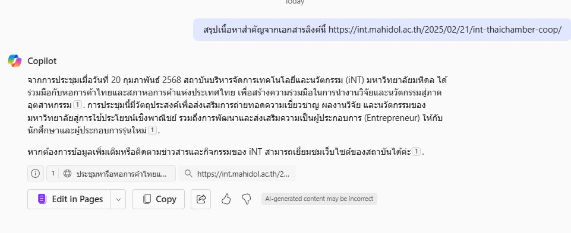

## ยกระดับการทำงานใน iNT ด้วย Google Gemini และ Microsoft Copilot

ในยุคที่เทคโนโลยี AI เข้ามามีบทบาทสำคัญในการทำงาน บุคลากร iNT สามารถใช้ประโยชน์จาก Google Gemini และ Microsoft Copilot เพื่อเพิ่มประสิทธิภาพและปลดล็อกศักยภาพใหม่ๆ ในการทำงานประจำวัน

<!-- truncate -->

## ผู้ช่วยอัจฉริยะสำหรับงานเอกสาร

### ร่างหนังสือราชการและอีเมลอย่างมืออาชีพ

เหนื่อยกับการร่างเอกสารราชการหรืออีเมลที่เป็นทางการใช่ไหม? ให้ Gemini และ Copilot ช่วยคุณ!

**ตัวอย่าง Prompt:**

* "ร่างหนังสือราชการ เรื่อง ขอความอนุเคราะห์สนับสนุนโครงการ \[ชื่อโครงการ] ถึง \[หน่วยงาน]"
* "ร่างอีเมลแจ้งกำหนดการประชุมทีม \[ชื่อทีม] ในวัน \[วัน] เวลา \[เวลา]"

**คำตอบจาก Google Gemini:**

**คำตอบจาก Microsoft Copilot:**

### สรุปและแก้ไขเอกสารอย่างรวดเร็ว

ต้องการสรุปเนื้อหาสำคัญจากเอกสารยาวๆ หรือแก้ไขข้อผิดพลาดทางไวยากรณ์ใช่ไหม? Gemini และ Copilot ช่วยคุณได้!

**ตัวอย่าง Prompt:**

* "สรุปเนื้อหาสำคัญจากเอกสาร \[ชื่อเอกสาร]"
* "แก้ไขข้อผิดพลาดทางไวยากรณ์และปรับปรุงสำนวนในย่อหน้านี้: \[ย่อหน้า]"

**คำตอบจาก Google Gemini:**

**คำตอบจาก Microsoft Copilot:**

## ผู้ช่วยวิเคราะห์และสืบค้นข้อมูล

### วิเคราะห์ข้อมูลและสร้างรายงาน

ต้องการวิเคราะห์ข้อมูลจำนวนมากหรือสร้างรายงานที่เข้าใจง่ายใช่ไหม? ใช้ Gemini และ Copilot เพื่อให้งานของคุณง่ายขึ้น!

**ตัวอย่าง Prompt:**

* "วิเคราะห์ข้อมูลยอดขายประจำปีและสร้างรายงานสรุป"
* "สร้างกราฟแสดงแนวโน้มการเติบโตของจำนวนผู้ใช้งาน"

**คำตอบจาก Microsoft Copilot:**

### ค้นหาข้อมูลและตอบคำถาม

ต้องการค้นหาข้อมูลเฉพาะหรือหาคำตอบสำหรับคำถามที่ซับซ้อนใช่ไหม? Gemini และ Copilot เป็นแหล่งข้อมูลที่ยอดเยี่ยม!

**ตัวอย่าง Prompt:**

* "ค้นหาข้อมูลเกี่ยวกับเทคโนโลยี \[ชื่อเทคโนโลยี] ล่าสุด"
* "ตอบคำถาม: \[คำถาม]"

**คำตอบจาก Google Gemini:**

**คำตอบจาก Microsoft Copilot:**

## เริ่มต้นใช้งาน Gemini และ Copilot วันนี้

บุคลากร iNT สามารถใช้ประโยชน์จาก Gemini และ Copilot เพื่อเพิ่มประสิทธิภาพในการทำงานและปลดล็อกศักยภาพใหม่ๆ ลองใช้เครื่องมือเหล่านี้วันนี้และสัมผัสประสบการณ์การทำงานที่ง่ายและมีประสิทธิภาพมากขึ้น โดยสามารถเข้าใช้งานได้ 2 ช่องทาง
:::note

- [Google Gemini](https://gemini.google.com/)
- [Microsoft Copilot](http://office.com/chat)

:::