## Canva: เครื่องมือออกแบบทรงพลังสำหรับบุคลากรมหาวิทยาลัยมหิดล

Canva เป็นแพลตฟอร์มออกแบบกราฟิกออนไลน์ที่ใช้งานง่าย เหมาะสำหรับบุคลากร ม.มหิดล ในการสร้างสรรค์สื่อต่างๆ ทั้งงานเอกสาร งานนำเสนอ สื่อโซเชียล และอื่นๆ อีกมากมาย

## 1. สมัครเข้าใช้งานด้วยอีเมลมหาวิทยาลัย

* เข้าไปที่เว็บไซต์ [Canva](https://www.canva.com/)
* เลือก "สมัครใช้งาน" หรือ "Sign up"
* เลือก "ดำเนินการต่อด้วยอีเมล" หรือ "Continue with email"
* ใช้อีเมลมหาวิทยาลัย (@mahidol.ac.th) ในการสมัคร
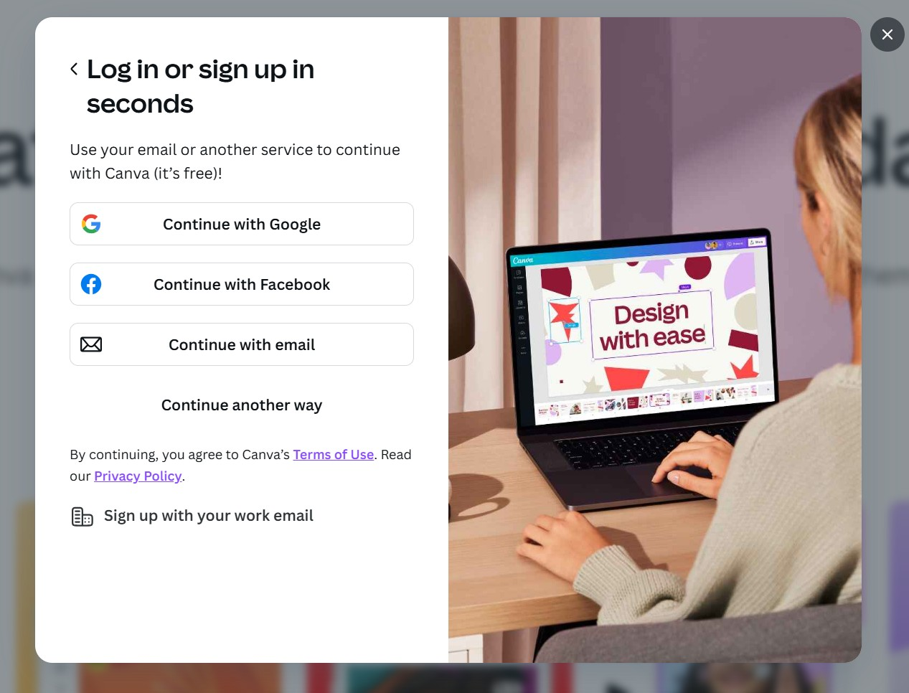
## 2. ขอสิทธิ์ Education

* หลังจากสมัครใช้งานแล้ว ให้ไปที่ "การตั้งค่าบัญชี" หรือ "Account settings"
* เลือก "การเรียกเก็บเงินและแผน" หรือ "Billing & plans"
* เลือก "Canva สำหรับการศึกษา" หรือ "Canva for Education"
* ทำตามขั้นตอนการยืนยันสิทธิ์ โดยอัปโหลดเอกสารที่เกี่ยวข้อง (เช่น บัตรบุคลากร)

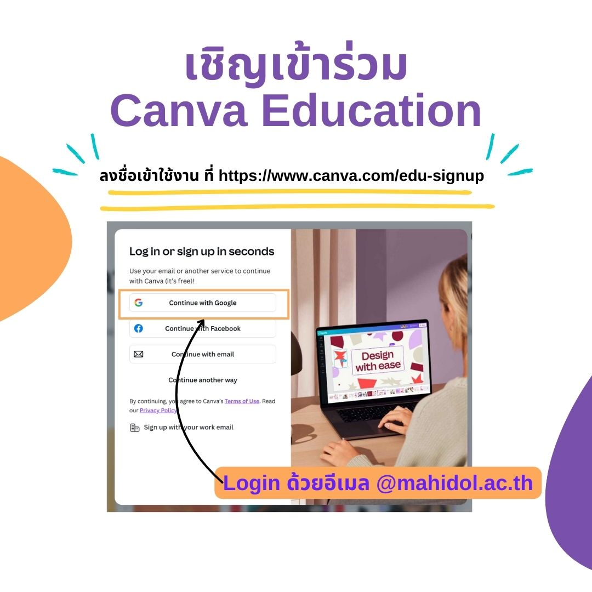
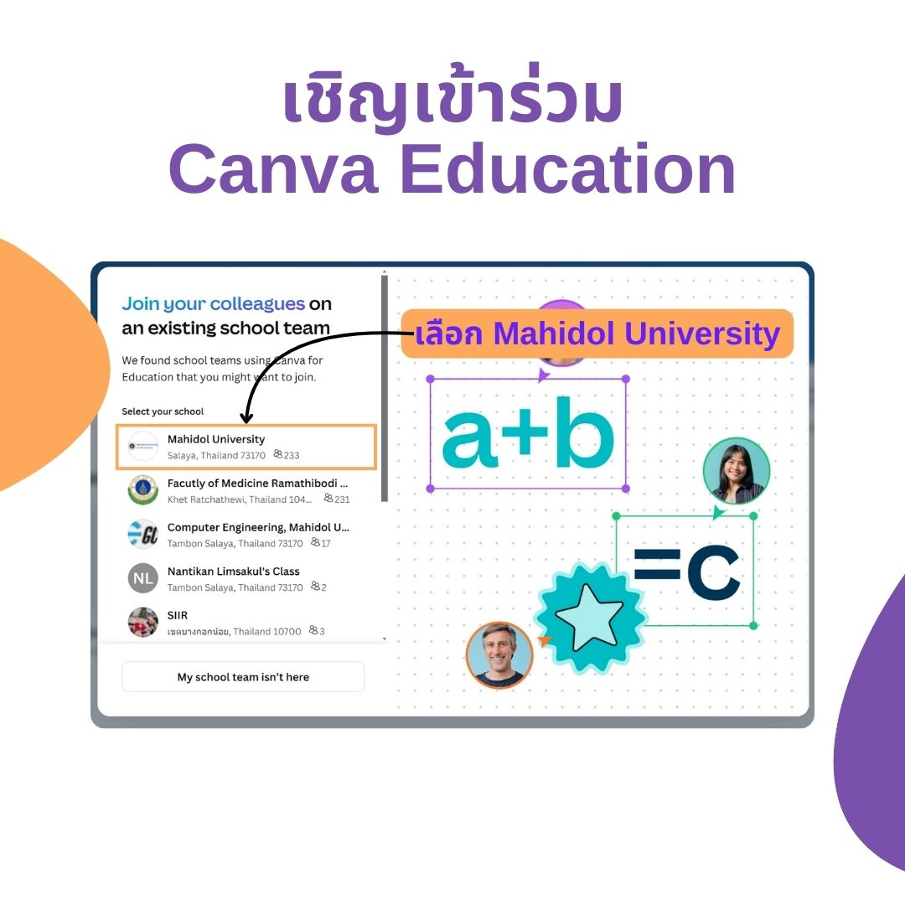
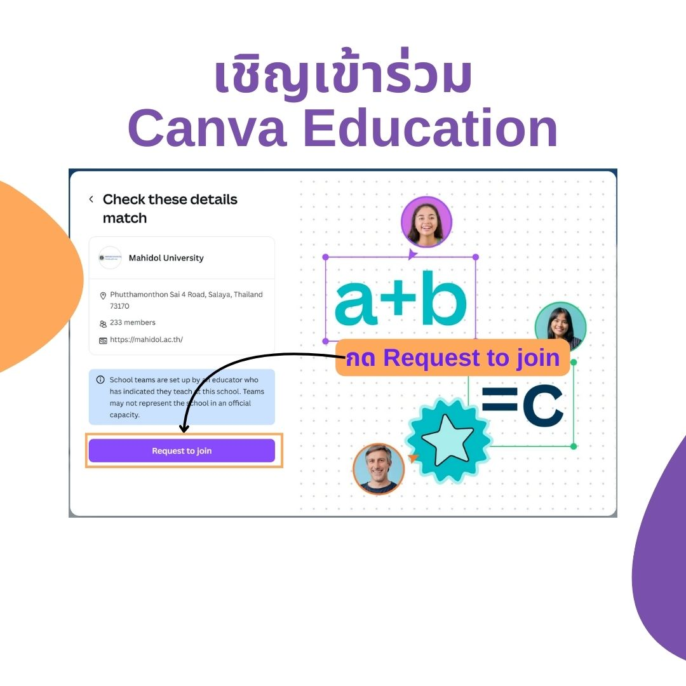
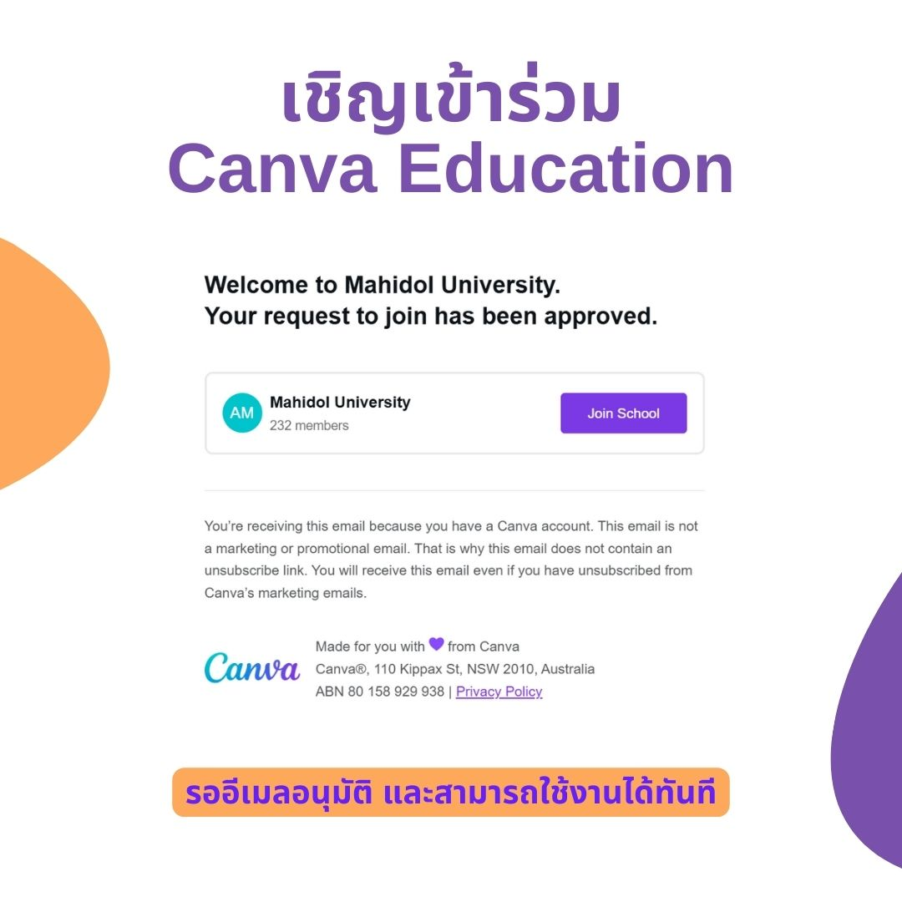

## 3. การสร้าง Design เบื้องต้น

* กด "สร้างงานออกแบบ" หรือ "Create a design"
* เลือกรูปแบบที่ต้องการ (เช่น งานนำเสนอ, โปสเตอร์, โพสต์โซเชียล)
* เลือกแม่แบบ (Template) หรือสร้างงานออกแบบด้วยตนเอง
* ปรับแต่งองค์ประกอบต่างๆ เช่น ข้อความ รูปภาพ สี และอื่นๆ
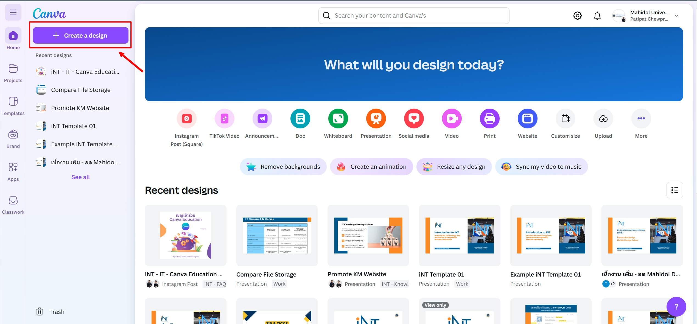
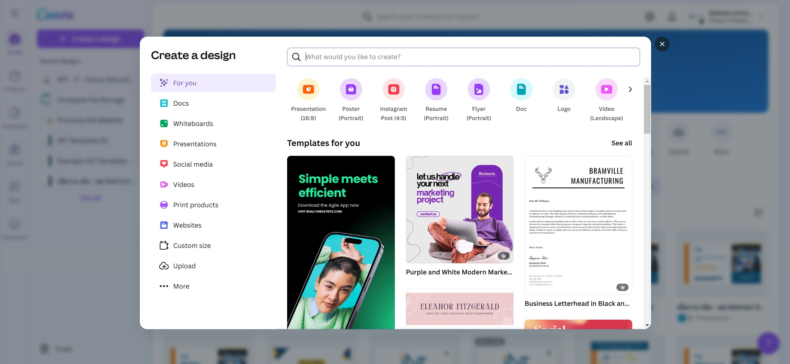

## 4. การแชร์ และการตั้งค่าการแชร์

* กด "แชร์" หรือ "Share" ที่มุมบนขวา
* กำหนดสิทธิ์การเข้าถึง (เช่น ดูได้อย่างเดียว, แก้ไขได้)
* แชร์ผ่านลิงก์ อีเมล หรือช่องทางอื่นๆ
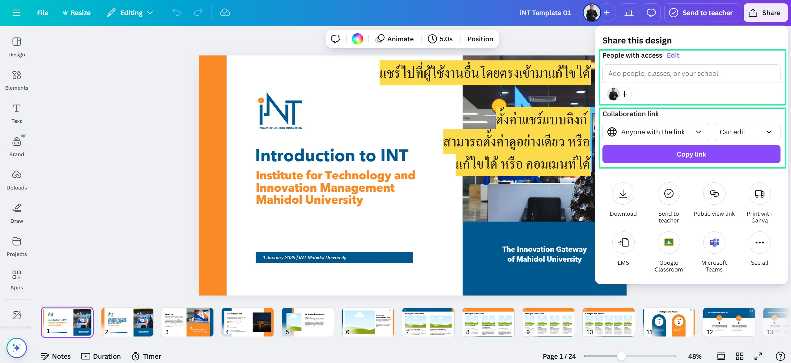

## 5. การดาวน์โหลดในรูปแบบไฟล์ต่างๆ

* กด "แชร์" หรือ "Share" ที่มุมบนขวา
* เลือก "ดาวน์โหลด" หรือ "Download"
* เลือกรูปแบบไฟล์ที่ต้องการ (เช่น PNG, JPG, PDF)
* กด "ดาวน์โหลด" หรือ "Download"
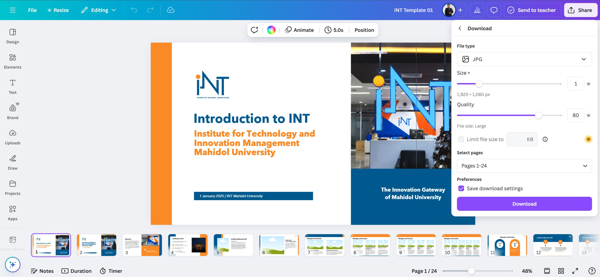

## เคล็ดลับเพิ่มเติม

* ใช้ประโยชน์จากแม่แบบ (Template) ที่มีให้เลือกมากมาย
* ปรับแต่งงานออกแบบให้ตรงตามอัตลักษณ์ของมหาวิทยาลัย
* สำรวจคลังรูปภาพและองค์ประกอบต่างๆ ของ Canva เพื่อเพิ่มความน่าสนใจให้กับงานออกแบบ

## แหล่งคลังรูปภาพฟรีสำหรับการใช้งานเชิงพาณิชย์

การใช้รูปภาพที่มีคุณภาพสูงสามารถช่วยเพิ่มความน่าสนใจให้กับงานออกแบบของคุณได้ นอกจาก Canva แล้ว ยังมีแหล่งคลังรูปภาพฟรีอื่นๆ ที่สามารถใช้งานได้เชิงพาณิชย์ ดังนี้:

1. [Unsplash](https://unsplash.com/)
    * คลังรูปภาพคุณภาพสูงที่สามารถใช้งานได้ฟรีทั้งในเชิงพาณิชย์และส่วนตัว
    * ไม่จำเป็นต้องให้เครดิตผู้ถ่ายภาพ แต่การให้เครดิตเป็นสิ่งที่ดี

2. [Pexels](https://www.pexels.com/)
    * คลังรูปภาพและวิดีโอฟรีที่สามารถใช้งานได้เชิงพาณิชย์
    * ไม่จำเป็นต้องให้เครดิตผู้ถ่ายภาพ แต่การให้เครดิตเป็นสิ่งที่ดี

3. [Pixabay](https://pixabay.com/)
    * คลังรูปภาพ วิดีโอ และกราฟิกเวกเตอร์ที่สามารถใช้งานได้ฟรีเชิงพาณิชย์
    * ไม่จำเป็นต้องให้เครดิตผู้ถ่ายภาพ แต่การให้เครดิตเป็นสิ่งที่ดี

4. [Freepik](https://www.freepik.com/)
    * คลังรูปภาพ กราฟิก และเวกเตอร์ที่มีทั้งแบบฟรีและแบบพรีเมียม
    * การใช้งานฟรีจำเป็นต้องให้เครดิตผู้สร้างสรรค์ผลงาน

5. [Burst by Shopify](https://burst.shopify.com/)
    * คลังรูปภาพฟรีที่เน้นการใช้งานเชิงพาณิชย์ โดยเฉพาะสำหรับธุรกิจออนไลน์
    * ไม่จำเป็นต้องให้เครดิตผู้ถ่ายภาพ แต่การให้เครดิตเป็นสิ่งที่ดี

การใช้คลังรูปภาพเหล่านี้จะช่วยให้คุณมีตัวเลือกมากขึ้นในการสร้างสรรค์งานออกแบบที่น่าสนใจและมีคุณภาพสูง

## ลิงก์ที่เกี่ยวข้อง

* [สไลด์แนะนำสถาบัน](https://www.canva.com/design/DAGdFlLJltY/0oLeeGjzea5GmhuLwQWlmg/edit)
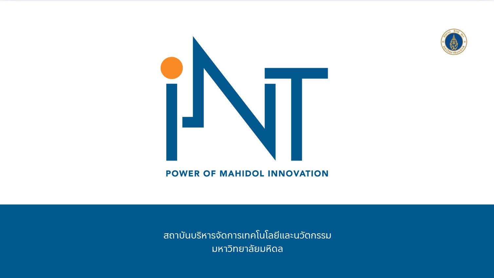
* [Template iNT](https://www.canva.com/design/DAGdd8PBZCs/Unt8P_UUFjx-1G921ZRvPQ/view?utm_content=DAGdd8PBZCs&utm_campaign=designshare&utm_medium=link&utm_source=publishsharelink&mode=preview)
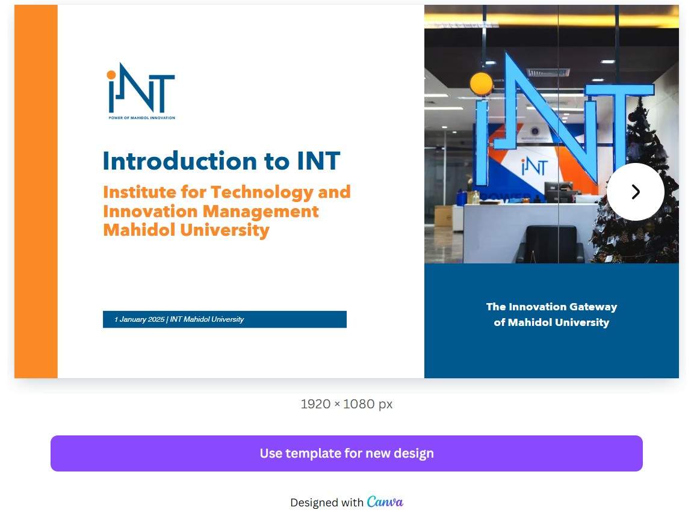

หวังว่าบล็อกโพสต์นี้จะเป็นประโยชน์สำหรับบุคลากรมหาวิทยาลัยมหิดลในการใช้งาน Canva นะครับ