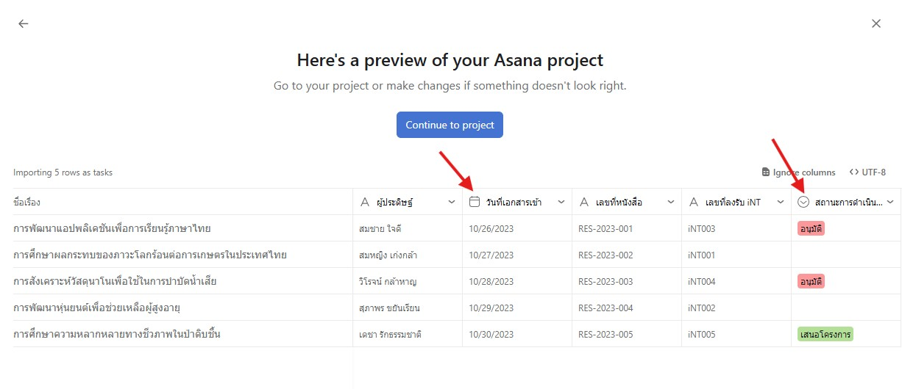

ต้องการนำข้อมูลจาก Excel เข้าสู่ Asana เพื่อการจัดการงานที่มีประสิทธิภาพมากขึ้น? เรามีวิธีง่ายๆ มาฝาก!
<!-- truncate -->

## ขั้นตอนการนำข้อมูลจาก Excel เข้า Asana

1. **เตรียมข้อมูล** โดยจะต้องมีการใส่ชื่อคอลัมน์ที่จะนำเข้าไว้บนสุดที่แถวที่ 1
    

    [ตัวอย่างไฟล์ Excel สำหรับนำเข้า](./asana/import-data/ImportDataToAsana.xlsx)

    ไฟล์ตัวอย่างข้อมูลจะมีคอลัมน์ดังนี้:
    - ชื่อเรื่องผู้ประดิษฐ์
    - วันที่เอกสารเข้า (เก็บในรูปแบบวันที่)
    - เลขที่หนังสือ
    - เลขที่ลงรับ iNT
    - สถานะการดำเนินงาน

2. **บันทึกไฟล์ในรูปแบบ CSV** โดยไปที่เมนู `File` > `Save as` และเลือกเป็นแบบ `CSV UTF-0 (Comma delimited) (*.csv)`
    
    จะได้ไฟล์ CSV ที่เป็นข้อมูลที่เตรียมไว้โดยสามารถสังเกตุได้จากรูปตัวอย่างด้านล่าง
    
    หมายเหตุ: สามารถปรับเปลี่ยนมุมมองของ Folder ให้เป็น Detail เพื่อเห็นนามสกุลไฟล์ได้
    
3. **ไปที่ Asana** เลือกทีมที่ต้องการ ไปที่แทป `All work` และกด `New Project`
    

4. **เลือก Import Project**
    

5. **ตั้งชื่อโปรเจ็คที่ต้องการ** และกด `Select file to import`
    

6. **เลือกไฟล์ที่เป็นสกุล CSV** สังเกตุจาก Type `Microsoft Excel Comma Separated Value File` หรือตรงส่วน Preview เป็นข้อมูลลักษณะคล้ายดังรูป เมื่อเลือกแล้วรอกระบวนการอัพโหลด และกด `Continue`
    
    

7. **กดเลือก Direct Import**
    

8. **แสดงตัวอย่างข้อมูล** ทำการกด `make change` เพื่อปรับประเภทข้อมูล
    
    จากข้อมูลข้างต้น วันที่เอกสารเข้า จะต้องเปลี่ยนเป็น `Date` และสถานะการดำเนินการ จะเปลี่ยนเป็น `Single Select` โดยกดที่ช่องข้อมูลและเลือกประเภทข้อมูลที่ต้องการ และเมื่อปรับเสร็จแล้วกด `Continue to project`
    

9. **รอการนำเข้าข้อมูลจนเสร็จ**
    

