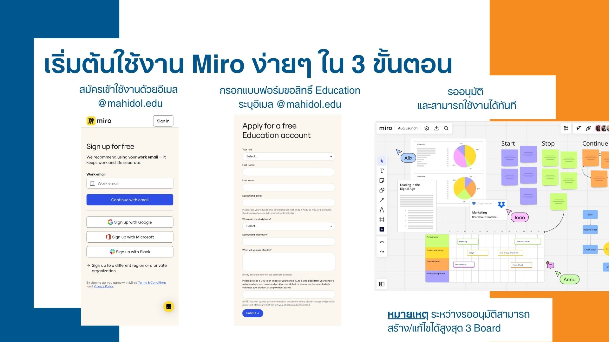
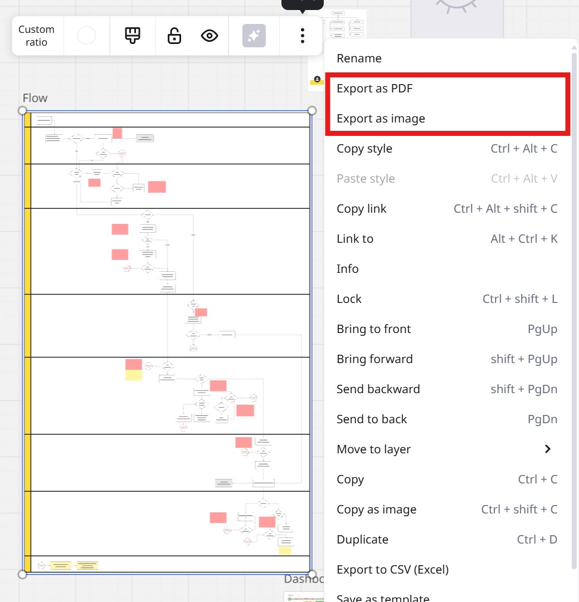

คุณเคยประสบปัญหาเหล่านี้หรือไม่?

* วาด Diagram บนกระดาษแล้วต้องมานั่งแก้ใหม่ทั้งหมดเมื่อมีการเปลี่ยนแปลง
* ส่งไฟล์ Diagram ให้เพื่อนร่วมงานแก้ไข แต่ไม่รู้ว่าใครแก้ไขอะไรไปบ้าง
* อยากได้เครื่องมือที่ช่วยให้สร้าง Diagram ได้หลากหลายรูปแบบ แต่หาเท่าไหร่ก็ไม่เจอ

ถ้าคำตอบคือ "ใช่" บทความนี้มีคำตอบสำหรับคุณ!

ขอแนะนำ Miro เครื่องมือทำงานร่วมกันแบบ Visual ที่จะช่วยให้การสร้าง Diagram ของคุณเป็นเรื่องง่ายและสนุกยิ่งขึ้น! และที่สำคัญ สำหรับชาว @mahidol.edu สามารถใช้งาน Miro ได้ฟรีๆ พร้อมสิทธิพิเศษมากมาย!

## Miro คืออะไร?

Miro คือแพลตฟอร์มทำงานร่วมกันแบบ Visual ที่ช่วยให้คุณและทีมสามารถระดมความคิด สร้าง Diagram วางแผนโครงการ และอื่นๆ อีกมากมาย บน Whiteboard ออนไลน์ที่ไม่จำกัด

## ทำไมต้อง Miro? (สำหรับชาวบุคลากรมหาวิทยาลัยมหิดล)

* **ใช้งานฟรี!** ด้วยสิทธิ์ Education เพียงลงทะเบียนด้วยอีเมล @mahidol.edu
* **สร้างและแก้ไขได้ถึง 100 Board ต่อผู้ใช้** ไม่ต้องกังวลเรื่องพื้นที่ไม่พอ
* **แชร์ให้เพื่อนร่วมงานได้ไม่จำกัด** ทำงานร่วมกันได้อย่างราบรื่น
* **มี Diagram ให้เลือกหลากหลาย** พร้อมอัปเดตเทมเพลตใหม่ๆ อยู่เสมอ
* **อัปเดตข่าวสารและแนวคิดการใช้งาน Miro** จากผู้ใช้ทั่วโลก

## เริ่มต้นใช้งาน Miro ง่ายๆ ใน 3 ขั้นตอน:

1.  **สมัครใช้งานด้วยอีเมล @mahidol.edu** เข้าไปที่เว็บไซต์ [Miro](https://miro.com/) และลงทะเบียนด้วยอีเมล @mahidol.edu ของคุณ
2.  **กรอกแบบฟอร์มขอสิทธิ์ Education** กรอกแบบฟอร์มที่ https://miro.com/contact/education/?ref=Educator ระบุอีเมล @mahidol.edu เพื่อยืนยันสิทธิ์การใช้งาน
3.  **รออนุมัติและเริ่มใช้งานได้ทันที!** (ระหว่างรออนุมัติ สามารถสร้าง/แก้ไขได้สูงสุด 3 Board)

## เคล็ดลับการใช้งาน Miro:

* ใช้เทมเพลตที่มีให้เลือกมากมาย เพื่อประหยัดเวลาในการสร้าง Diagram
* ทำงานร่วมกันแบบเรียลไทม์กับเพื่อนร่วมงาน โดยการแชร์ Board ให้พวกเขา
* ใช้ Sticky Notes เพื่อระดมความคิดและจดบันทึก
* ทดลองใช้ฟีเจอร์ต่างๆ ของ Miro เพื่อค้นหาเครื่องมือที่เหมาะกับการใช้งานของคุณ

## การ Export เป็น PDF หรือรูปภาพที่มีความละเอียดสูง:

Miro ช่วยให้คุณสามารถ Export งานของคุณเป็น PDF หรือรูปภาพที่มีความละเอียดสูงได้ง่ายๆ เพื่อการนำเสนอหรือการพิมพ์:

1. **Export เป็น PDF**:
    - คลิกที่ปุ่ม "Export this board" ที่มุมขวาบนของหน้าจอ
    - เลือก "Save as PDF"
    - กำหนดขนาดและคุณภาพของไฟล์ตามที่คุณต้องการ
    - กด "Export" เพื่อดาวน์โหลดไฟล์ PDF

2. **Export เป็นรูปภาพ (PNG/JPG)**:
    - คลิกที่ปุ่ม "Export this board"
    - เลือก "Save as image"
    - เลือกประเภทไฟล์ (PNG หรือ JPG) และปรับความละเอียด
    - กด "Export" เพื่อดาวน์โหลดรูปภาพ

**เคล็ดลับ**: หากต้องการความละเอียดสูงสำหรับการพิมพ์ ให้เลือกความละเอียดสูงสุดในขั้นตอนการ Export เพื่อให้ได้ผลลัพธ์ที่ดีที่สุด!

## บทสรุป:

Miro เป็นเครื่องมือที่ยอดเยี่ยมสำหรับทุกคนที่ต้องการสร้าง Diagram อย่างง่ายดายและมีประสิทธิภาพ ด้วยสิทธิพิเศษสำหรับชาวบุคลากรมหาวิทยาลัยมหิดล ทำให้ Miro เป็นตัวเลือกที่ไม่ควรพลาด!

## Call to Action:

* ลงทะเบียนใช้งาน Miro ฟรี! [https://miro.com/signup/](https://miro.com/signup/)
* เรียนรู้เพิ่มเติมเกี่ยวกับ Miro [https://miro.com/diagramming/](https://miro.com/diagramming/)
* แบ่งปันบทความนี้ให้เพื่อนร่วมงานของคุณ!