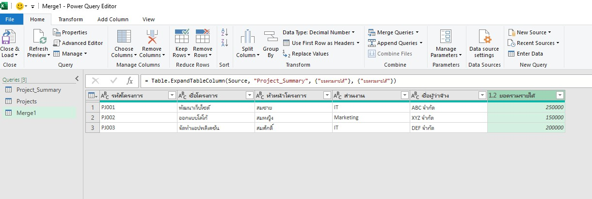

## เบื่อไหมกับการสรุปข้อมูลรายได้โครงการแบบเดิมๆ?

หากคุณต้องจัดการข้อมูลรายได้โครงการจำนวนมากใน Excel และต้องการสรุปยอดรวมรายได้ของแต่ละโครงการ การใช้สูตร Excel แบบเดิมๆ อาจทำให้เสียเวลาและเกิดข้อผิดพลาดได้ง่าย

วันนี้เราขอแนะนำเครื่องมือทรงพลังที่จะช่วยให้คุณสรุปข้อมูลได้อย่างรวดเร็วและแม่นยำ นั่นก็คือ **Power Query**!
<!-- truncate -->
## Power Query คืออะไร?

Power Query เป็นเครื่องมือ ETL (Extract, Transform, Load) ที่มาพร้อมกับ Excel ช่วยให้คุณดึงข้อมูลจากแหล่งต่างๆ มาแปลงรูปและจัดระเบียบข้อมูล ก่อนที่จะนำไปวิเคราะห์หรือสร้างรายงาน

## ตัวอย่าง: สรุปข้อมูลรายได้โครงการ

สมมติว่าคุณมีข้อมูลรายได้โครงการในไฟล์ Excel ดังนี้:

| รหัสโครงการ | ชื่อโครงการ | หัวหน้าโครงการ | ส่วนงาน | ชื่อผู้ว่าจ้าง | งวดงาน | จำนวนเงินรับสุทธิ |
|---|---|---|---|---|---|---|
| PJ001 | พัฒนาเว็บไซต์ | สมชาย | IT | ABC จำกัด | งวด 1 | 100,000 |
| PJ001 | พัฒนาเว็บไซต์ | สมชาย | IT | ABC จำกัด | งวด 2 | 150,000 |
| PJ002 | ออกแบบโลโก้ | สมหญิง | Marketing | XYZ จำกัด | งวด 1 | 50,000 |
| PJ002 | ออกแบบโลโก้ | สมหญิง | Marketing | XYZ จำกัด | งวด 2 | 75,000 |
| PJ002 | ออกแบบโลโก้ | สมหญิง | Marketing | XYZ จำกัด | งวด 3 | 25,000 |
| PJ003 | จัดทำแอปพลิเคชัน | สมศักดิ์ | IT | DEF จำกัด | งวด 1 | 200,000 |
:::info[**ไฟล์ประกอบ**]
[ไฟล์ตัวอย่างข้อมูลโครงการ](./excel/project_operation_result.xlsx)
:::
ต้องการสรุปยอดรวมรายได้ของแต่ละโครงการ โดยต้องการผลลลัพธ์เป็นตารางที่แสดงรหัสโครงการ ชื่อโครงการ หัวหน้าโครงการ ส่วนงาน ชื่อผู้ว่าจ้าง และยอดรวมรายได้
| รหัสโครงการ | ชื่อโครงการ | หัวหน้าโครงการ | ส่วนงาน | ชื่อผู้ว่าจ้าง | ยอดรวมรายได้ |
|---|---|---|---|---|---|
| PJ001 | พัฒนาเว็บไซต์ | สมชาย | IT | ABC จำกัด | 250,000 |
| PJ002 | ออกแบบโลโก้ | สมหญิง | Marketing | XYZ จำกัด | 150,000 |
| PJ003 | จัดทำแอปพลิเคชัน | สมศักดิ์ | IT | DEF จำกัด | 200,000 |

### ขั้นตอนการใช้งาน Power Query

1.  **นำข้อมูลเข้า Power Query:**
    * เปิด Excel ใหม่และไปที่แท็บ "Data"
    * เลือก "Get Data" > "Form File" > "From Excel Workbook" เพื่อนำข้อมูลจากตาราง Excel เข้า Power Query Editor
    
    
    * เลือกไฟล์ Excel ที่มีข้อมูลโครงการและเลือกตารางที่ต้องการนำเข้า
    * เลือกข้อมูลที่อยู่ใน Table "Projects" และกด "Load" เพื่อโหลดข้อมูลเข้า Power Query Editor และ Excel Workbook นี้
    
    
    
2. **ดูข้อมูลใน Power Query Editor:** จะมีคอลัมน์ "รหัสโครงการ", "ชื่อโครงการ", "หัวหน้าโครงการ", "ส่วนงาน", "ชื่อผู้ว่าจ้าง", "งวดงาน" และ "จำนวนเงินรับสุทธิ"
    * คลิกขวาที่ Query ที่โหลดข้อมูลมาแล้วเลือก "Edit" เพื่อเปิด Power Query Editor
    * คุณจะเห็นข้อมูลในตารางที่โหลดเข้ามาใน Power Query Editor

    
    

3.  **ใช้คำสั่งการสรุปข้อมูล Group by**
    > Group by เป็นคำสั่งที่ใช้ในการจัดกลุ่มข้อมูลตามคอลัมน์ที่เลือก และสามารถทำการคำนวณค่าต่างๆ เช่น ผลรวม, ค่าเฉลี่ย, นับจำนวน เป็นต้น
    * เลือกคอลัมน์ "รหัสโครงการ" เป็นข้อมูลที่ระบุข้อมูลของแต่ละโครงการ
    * เลือกเมนู "Transform" > "Group By"
    
    * ตั้งชื่อคอลัมน์ใหม่เป็น "ยอดรวมรายได้" และเลือกการคำนวณเป็น "Sum" จากคอลัมน์ "จำนวนเงินรับสุทธิ"
    * กด "OK" เพื่อสร้างตารางใหม่ที่มีคอลัมน์ "รหัสโครงการ" และ "ยอดรวมรายได้"
    
    
    * เปลี่ยนชื่อ Query เป็น "Project_Summary" เพื่อให้เข้าใจง่ายขึ้น โดยคลิกขวาที่ Query และเลือก "Rename"
    

4.  **หาโครงการทั้งหมด โดยเอาข้อมูลที่ซ้ำออก**
    * เลือก Recent Source ใน Power Query Editor โดยเลือกไฟล์ Excel ที่มีข้อมูลโครงการ
    * ลบคอลัมน์ "งวดงาน" และ "จำนวนเงินรับสุทธิ" จากการเลือกคอลัมน์ทั้ง 2 คอลัมน์ โดยการกดปุ่ม "Remove Columns" ในเมนู "Home"
    
    
    * เลือกคอลัมน์ "รหัสโครงการ" และคลิกขวาเลือก "Remove Duplicates" เพื่อให้เหลือเฉพาะข้อมูลที่ไม่ซ้ำกัน
    
    

5.  **Merge Queries:**
    * Merge Query จากขั้นตอนที่ 4 และ 5 โดยใช้คอลัมน์ "รหัสโครงการ" เป็น Match
    * เลือก "Home" > "Merge Queries" > "Merge Queries as New"
    * เลือก Query  "Projects" และ "Project_Summary" ตามลำดับ จากนั้นเลือกคอลัมน์ "รหัสโครงการ" ในทั้งสอง Query
    * เลือก Join Kind เป็น "Left Outer" เพื่อให้ได้ข้อมูลจาก Query "Project_Summary" และข้อมูลที่ตรงกันจาก Query "Projects"
    
    

6.  **Expand Column:**
    * Expand คอลัมน์ที่ได้จากการ Merge เพื่อแสดงยอดรวมรายได้ของแต่ละโครงการ
    * คลิกที่ปุ่ม Expand (ลูกศรชี้ซ้ายขวา) ที่อยู่ข้างๆ ชื่อคอลัมน์ Project_Summary
    * เลือกคอลัมน์ที่ต้องการแสดงในตาราง คือ "ยอดรวมรายได้" และกด "OK" ติดถูกออกที่ "Use original column name as prefix" เพื่อไม่ให้มีชื่อ project_summary ขึ้นหน้าชื่อคอลัมน์
    
    

7.  **Save & Load:**
    * เปลี่ยนชื่อ Query เป็น "Report" โดยคลิกขวาที่ Query และเลือก "Rename"
    * เมื่อได้ตารางที่ต้องการแล้ว ให้เลือก "Close & Load" เพื่อบันทึกข้อมูลกลับไปยัง Excel
    
    
### ผลลัพธ์

คุณจะได้ตารางสรุปยอดรวมรายได้ของแต่ละโครงการ ดังนี้:

| รหัสโครงการ | ชื่อโครงการ | หัวหน้าโครงการ | ส่วนงาน | ชื่อผู้ว่าจ้าง | ยอดรวมรายได้ |
|---|---|---|---|---|---|
| PJ001 | พัฒนาเว็บไซต์ | สมชาย | IT | ABC จำกัด | 250,000 |
| PJ002 | ออกแบบโลโก้ | สมหญิง | Marketing | XYZ จำกัด | 150,000 |
| PJ003 | จัดทำแอปพลิเคชัน | สมศักดิ์ | IT | DEF จำกัด | 200,000 |

## ทำไมต้องใช้ Power Query?

* **รวดเร็ว:** สรุปข้อมูลจำนวนมากได้ในไม่กี่คลิก
* **แม่นยำ:** ลดความผิดพลาดจากการใช้สูตร Excel แบบเดิมๆ
* **ยืดหยุ่น:** สามารถปรับเปลี่ยนขั้นตอนการสรุปข้อมูลได้ง่าย
* **อัตโนมัติ:** เมื่อข้อมูลต้นฉบับมีการเปลี่ยนแปลง สามารถ Refresh ข้อมูลใน Power Query ได้ทันที

## ฟีเจอร์เพิ่มเติมที่น่าสนใจของ Power Query

1. **รองรับการเชื่อมต่อข้อมูลจากหลากหลายแหล่ง:**
    Power Query สามารถดึงข้อมูลจากแหล่งข้อมูลต่างๆ เช่น SQL Server, SharePoint, CSV, JSON, และอื่นๆ ได้อย่างง่ายดาย

2. **การทำความสะอาดข้อมูลอัตโนมัติ:**
    มีเครื่องมือช่วยลบข้อมูลที่ซ้ำกัน, เติมค่าที่ขาดหาย, และแปลงข้อมูลให้อยู่ในรูปแบบที่ต้องการโดยไม่ต้องเขียนโค้ด

3. **การรวมข้อมูลจากหลายไฟล์:**
    สามารถรวมข้อมูลจากหลายไฟล์ Excel หรือ CSV ที่มีโครงสร้างเหมือนกันได้ในคลิกเดียว

4. **การสร้างคอลัมน์คำนวณใหม่:**
    เพิ่มคอลัมน์ใหม่ที่คำนวณจากข้อมูลเดิม เช่น การคำนวณเปอร์เซ็นต์, การรวมข้อความ หรือการแปลงวันที่

5. **การอัปเดตข้อมูลแบบเรียลไทม์:**
    เมื่อข้อมูลต้นทางมีการเปลี่ยนแปลง คุณสามารถกด Refresh เพื่ออัปเดตข้อมูลในรายงานได้ทันทีโดยไม่ต้องทำซ้ำขั้นตอนเดิม

