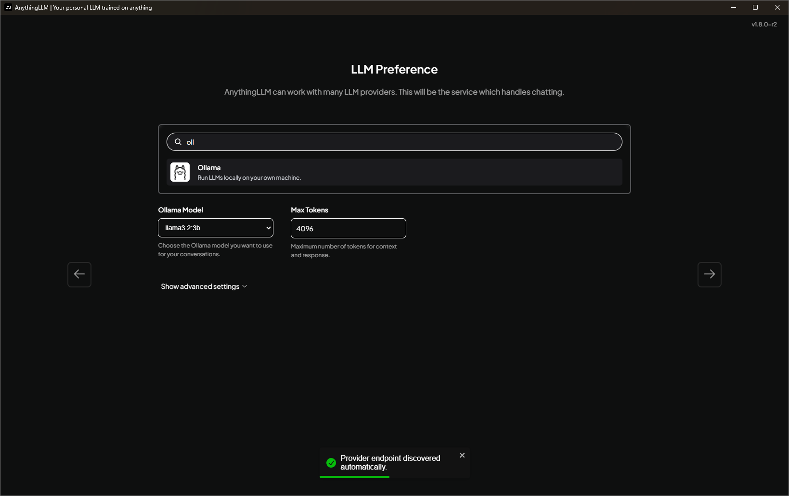
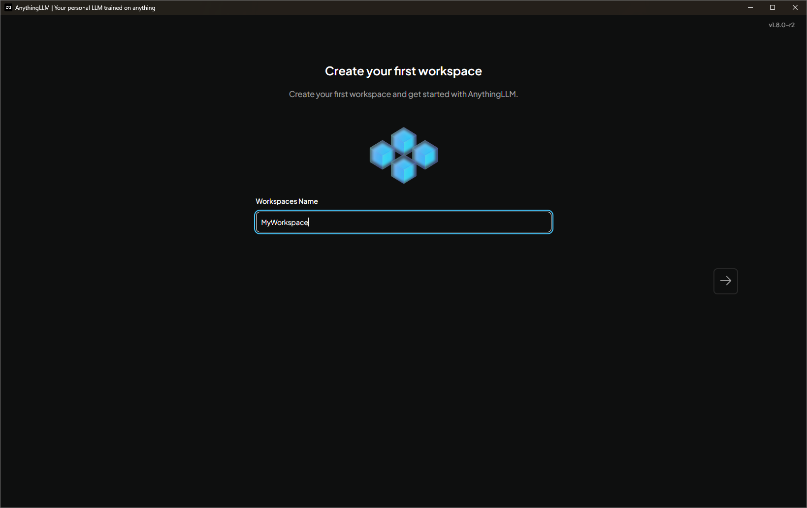
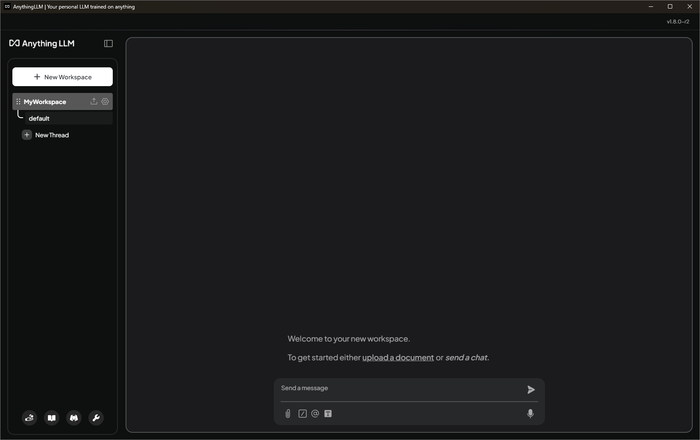
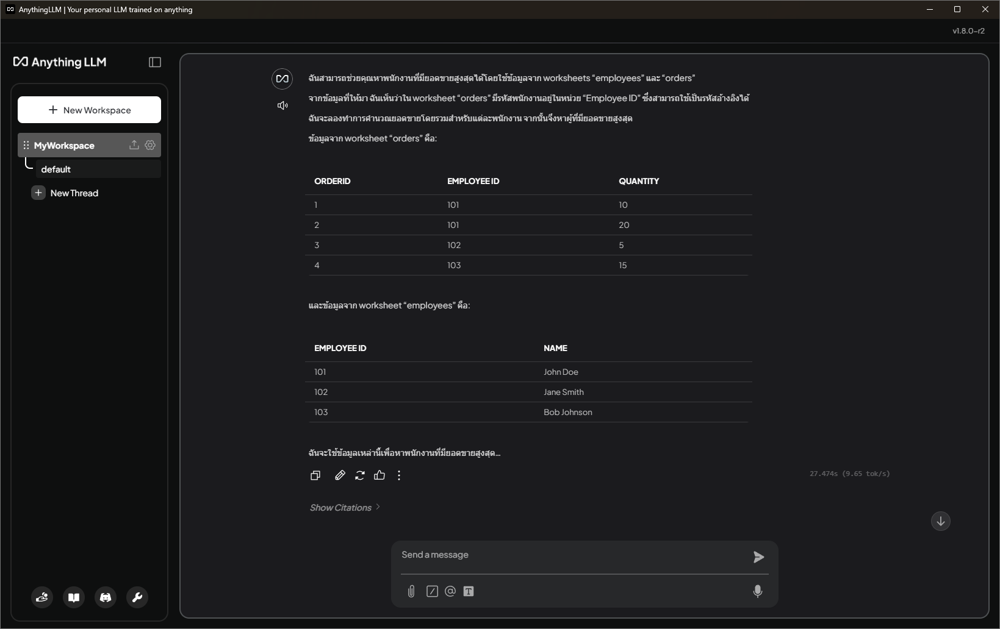

## บทนำ

เมื่อเราใช้งาน Generative AI เช่น ChatGPT, Gemini, หรือ Copilot เรามักพบว่าคำตอบที่ได้รับอาจไม่ครบถ้วนสมบูรณ์ หรือในกรณีที่ต้องการคำตอบที่มีความละเอียดและเจาะลึกมากขึ้น เราอาจต้องใช้เวลาในการเขียน _prompt_ อย่างพิถีพิถันหลายรอบเพื่อให้ได้ผลลัพธ์ที่ตรงตามความต้องการ ซึ่งอาจเป็นกระบวนการที่ยุ่งยากและใช้เวลามาก โดยเฉพาะอย่างยิ่งสำหรับผู้ที่ต้องการคำตอบที่มีความแม่นยำสูงและสามารถนำไปใช้งานได้ทันที  

ในบทความนี้ เราจะแนะนำวิธีการตั้งค่าและใช้งาน Generative AI บนเครื่องของคุณเองแบบออฟไลน์ 100% ซึ่งเป็นทางเลือกที่ช่วยลดข้อจำกัดต่างๆ ไม่ว่าจะเป็นการพึ่งพาการเชื่อมต่ออินเทอร์เน็ต การสมัครสมาชิก หรือการจ่ายค่าบริการรายเดือน คุณสามารถใช้งานได้อย่างอิสระโดยไม่มีข้อจำกัดใดๆ และไม่จำเป็นต้องเป็นผู้เชี่ยวชาญด้าน AI ก็สามารถเริ่มต้นใช้งานได้ง่ายๆ ด้วยขั้นตอนที่ไม่ซับซ้อน พร้อมทั้งสามารถปรับแต่งการทำงานของโมเดลให้เหมาะสมกับความต้องการเฉพาะของคุณได้อย่างเต็มที่  

<!-- truncate -->
## ทำไมต้องใช้งาน Generative AI แบบออฟไลน์

- ปลอดภัยต่อข้อมูลส่วนตัว ไม่ต้องส่งข้อความขึ้นคลาวด์  
- ไม่มีค่าบริการรายเดือนหรือข้อจำกัดเรื่องโควต้า  
- ปรับแต่งและควบคุมพฤติกรรมของโมเดลได้เต็มที่  
- ลดความหน่วง (latency) ในการประมวลผล  

## โมเดล LLM ที่ใช้งานออฟไลน์ได้

1. **Llama 2 (Meta)**  
2. **GPT4All**  
3. **Mistral**  
4. **Gemma3**  


## ขั้นตอนติดตั้งและใช้งานเบื้องต้น

1. ดาวน์โหลดและติดตั้ง Ollama Desktop: ไปที่ https://ollama.com และเลือก Windows installer  
2. รันตัวติดตั้งและทำตามขั้นตอนจนเสร็จ  
3. ดาวน์โหลดและติดตั้ง AnythingLLM Desktop: ไปที่ https://anythingllm.com/desktop และเลือก Windows installer  
4. รันตัวติดตั้ง AnythingLLM Desktop และทำตามขั้นตอนจนเสร็จ  
5. เปิด PowerShell แล้วติดตั้งโมเดล llama-3.2:3b  
   ```bash
   ollama pull llama-3.2-3b
   ```  
6. คำอธิบาย:  
   - "3.2" คือรุ่นของโมเดล  
   - "3b" หมายถึงจำนวนพารามิเตอร์ประมาณ 3 พันล้าน (b = billion)  
7. การเลือกขนาดโมเดลให้เหมาะสม:  
   - หากเครื่องมี RAM >= 16 GB แนะนำใช้ 3b  
   - หาก RAM 8–16 GB ใช้รุ่น 2b หรือตัวเล็กกว่าเพื่อประสิทธิภาพที่ดี  
8. ตั้งค่า AnythingLLM Desktop:  
    - 8.1 เปิดโปรแกรม AnythingLLM Desktop แล้วเลือกโมเดล "ollama"  
        
    - 8.2 สร้าง Workspace ใหม่: คลิก "New Workspace" แล้วตั้งชื่อตามต้องการ  
        
    - 8.3 เปิดหน้าต่างแชท (Chat) ใน Workspace ที่สร้างขึ้น  
        
    - 8.4 อัปโหลดไฟล์ Excel ที่ต้องการให้โมเดลวิเคราะห์ลงในหน้าต่างแชท  
    - 8.5 ทดสอบพิมพ์คำสั่ง เช่น  
      ```text
      ช่วยวิเคราะห์ข้อมูลพนักงานในไฟล์นี้และหาพนักงานที่มียอดขายสูงสุด
      โดยข้อมูลพนักงานจะอยู่ใน Worksheet Employees และข้อมูลการขายจะอยู่ใน Worksheet Orders
      ```  
    - 8.6 ผลับคำตอบจากโมเดลในหน้าต่างแชท  
      

## สรุป
การใช้งาน Generative AI แบบออฟไลน์บนเครื่องของคุณเองมีข้อดีหลายประการ ทั้งในด้านความปลอดภัย ความสะดวก และความคุ้มค่า โดยในบทความนี้เราได้แนะนำขั้นตอนการติดตั้งและใช้งานโมเดล LLM ที่สามารถทำงานได้แบบออฟไลน์ เช่น Llama 2, GPT4All, Mistral และ Gemma3 ผ่านซอฟต์แวร์อย่าง Ollama Desktop และ AnythingLLM Desktop

ขั้นตอนเริ่มต้นนั้นไม่ซับซ้อน เพียงดาวน์โหลดและติดตั้งซอฟต์แวร์ที่จำเป็น จากนั้นเลือกโมเดลที่เหมาะสมกับทรัพยากรของเครื่อง เช่น RAM และขนาดของโมเดลที่ต้องการใช้งาน หลังจากตั้งค่าเสร็จ คุณสามารถเริ่มต้นใช้งานได้ทันที ไม่ว่าจะเป็นการวิเคราะห์ข้อมูลในไฟล์ Excel หรือการตั้งคำถามเพื่อให้โมเดลช่วยแก้ปัญหาเฉพาะทาง

การใช้งาน Generative AI แบบออฟไลน์ช่วยให้คุณสามารถควบคุมข้อมูลและการประมวลผลได้อย่างเต็มที่ ลดความเสี่ยงจากการส่งข้อมูลขึ้นคลาวด์ และยังช่วยลดค่าใช้จ่ายในระยะยาว เนื่องจากไม่มีค่าบริการรายเดือนหรือข้อจำกัดเรื่องโควต้า นอกจากนี้ คุณยังสามารถปรับแต่งโมเดลให้เหมาะสมกับความต้องการเฉพาะของคุณได้อีกด้วย

ด้วยความสามารถที่หลากหลายและความยืดหยุ่นในการใช้งาน Generative AI แบบออฟไลน์จึงเป็นทางเลือกที่น่าสนใจสำหรับผู้ที่ต้องการประสิทธิภาพสูงสุดโดยไม่ต้องพึ่งพาอินเทอร์เน็ตหรือบริการจากผู้ให้บริการภายนอก