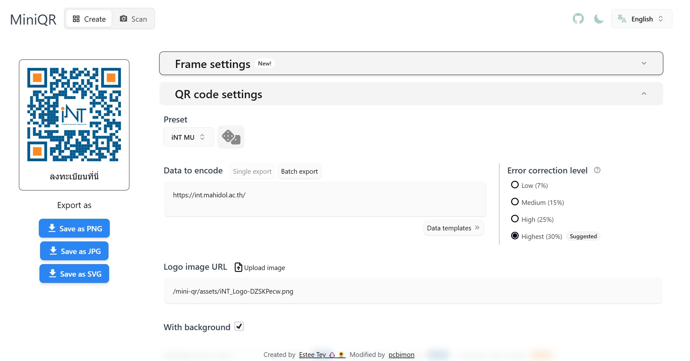
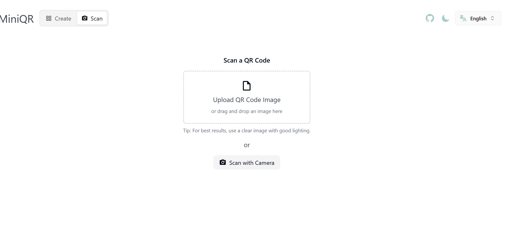

## บทนำ

MiniQR เป็นแอปพลิเคชันที่ออกแบบมาเพื่อช่วยให้ผู้ใช้งานสามารถสร้าง QR Code ได้อย่างง่ายดาย พร้อมฟีเจอร์ที่หลากหลายสำหรับการปรับแต่ง QR Code ให้เหมาะสมกับความต้องการของคุณ ไม่ว่าจะเป็นการตั้งค่ากรอบ การเลือกสี หรือการเพิ่มโลโก้ ในบทความนี้ เราจะพาคุณไปรู้จักกับฟีเจอร์ทั้งหมดของ MiniQR

<!-- truncate -->

## ส่วนการตั้งค่า (Settings Sections)

### Frame settings: การตั้งค่ากรอบของ QR Code

- **Add frame**: เพิ่มกรอบให้ QR Code
- **Frame text**: เพิ่มข้อความในกรอบ
- **Text position**: ตัวเลือกตำแหน่งข้อความ (บน, ล่าง, ซ้าย, ขวา)
- **Frame style**: เลือกรูปแบบของกรอบ
- **Text color**: เลือกสีข้อความ
- **Background color**: เลือกสีพื้นหลัง
- **Border color**: เลือกสีขอบ
- **Border width**: กำหนดความกว้างของขอบ

### QR code settings: การตั้งค่าเนื้อหาและลักษณะของ QR Code

- **Preset**: เลือกค่าที่ตั้งไว้ล่วงหน้า
- **Data to encode**: เลือกรูปแบบข้อมูล (ข้อมูลเดี่ยว, นำเข้าข้อมูลแบบกลุ่ม)
- **Error correction level**: ตัวเลือกระดับการแก้ไขข้อผิดพลาด (ต่ำ (L), กลาง (M), สูง (Q), สูงสุด (H) / สูงสุดพิเศษ (H++))
- **Logo image URL**: ใส่ URL หรืออัปโหลดรูปภาพโลโก้

### With background: การตั้งค่าพื้นหลัง

- **Background color**: เลือกสีพื้นหลัง
- **Dots color**: เลือกสีของจุดภายใน QR Code
- **Corners Square color**: เลือกสีของมุมสี่เหลี่ยม
- **Corners Dot color**: เลือกสีของจุดที่มุม
- **Width (px)**: กำหนดความกว้าง
- **Height (px)**: กำหนดความสูง
- **Border radius (px)**: กำหนดรัศมีของขอบ
- **Margin (px)**: กำหนดระยะขอบ
- **Image margin (px)**: กำหนดระยะขอบของภาพ

### Dots type: รูปแบบของจุดภายใน QR Code

- ตัวเลือกต่างๆ เช่น Circle, Rounded, Square, Extra rounded, Diamond, Star, Custom image

### Corners Square Type: รูปแบบของมุมสี่เหลี่ยม

- ตัวเลือกต่างๆ เช่น Square, Rounded, Extra rounded

### Corners Dot Type: รูปแบบของจุดที่มุม

- ตัวเลือกต่างๆ เช่น Square, Circle

## Scan
### ฟีเจอร์การสแกน QR Code

- **Scan from Camera**: เปิดกล้องเพื่อสแกน QR Code แบบเรียลไทม์
- **Scan from Image**: อัปโหลดรูปภาพเพื่อสแกน QR Code ที่อยู่ในภาพ

## สรุป

MiniQR เป็นแอปพลิเคชันที่ครบครันสำหรับการสร้างและปรับแต่ง QR Code ด้วยฟีเจอร์ที่หลากหลายและใช้งานง่าย คุณสามารถเริ่มต้นใช้งาน MiniQR ได้แล้ววันนี้ที่ [MiniQR](https://pcbimon.github.io/mini-qr/)