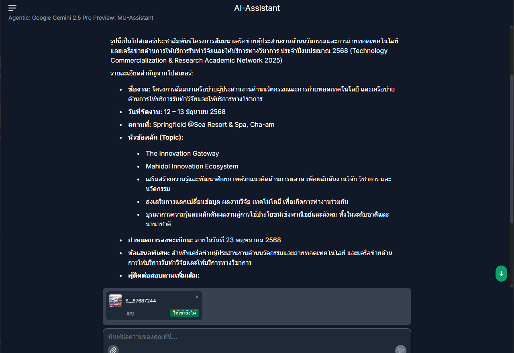

# MARVIS: ระบบ AI อัจฉริยะเพื่อการเรียนรู้และการบริหารจัดการ

MARVIS หรือ Mahidol’s Adaptive Research & Visionary Intelligence System เป็นระบบปัญญาประดิษฐ์ที่ถูกออกแบบมาเพื่อยกระดับการเรียนรู้ การวิจัย และการจัดการงานในองค์กรให้มีประสิทธิภาพมากยิ่งขึ้น
<!-- truncate -->
## จุดเด่นของ MARVIS

- **รองรับทั้งภาษาไทยและภาษาอังกฤษ** ช่วยให้การสื่อสารและการทำงานเป็นไปอย่างราบรื่น
- **ตอบโจทย์หลากหลายความต้องการ** ไม่ว่าจะเป็นการตอบคำถาม การสร้างเอกสาร การวิเคราะห์ข้อมูล หรือการสรุปเนื้อหา
- **ใช้งานได้ในหลายบริบท** เช่น การศึกษา การวิจัย และงานธุรการ
- **ปลอดภัยและใช้งานง่าย** ข้อมูลขององค์กรจะถูกเก็บรักษาอย่างปลอดภัย ไม่ถูกส่งออกไปภายนอก

MARVIS เป็นอีกหนึ่งความก้าวหน้าของมหาวิทยาลัยมหิดลที่มุ่งเน้นการนำเทคโนโลยี AI มาช่วยขับเคลื่อนองค์กรให้ทันสมัยและมีประสิทธิภาพมากขึ้น

## วิธีการเข้าใช้งาน

ผู้ใช้งานสามารถเข้าใช้งาน MARVIS ได้ที่: [https://marvis.mahidol.ac.th/](https://marvis.mahidol.ac.th/)

เปิดบริการตั้งแต่วันที่ 14 พฤษภาคม 2568

## คู่มือการใช้งาน

สำหรับผู้ที่ต้องการเรียนรู้เพิ่มเติมเกี่ยวกับการใช้งาน MARVIS สามารถดาวน์โหลดคู่มือได้ที่: [https://muit.mahidol.ac.th/documents/userguide/ai/marvis.pdf](https://muit.mahidol.ac.th/documents/userguide/ai/marvis.pdf)

