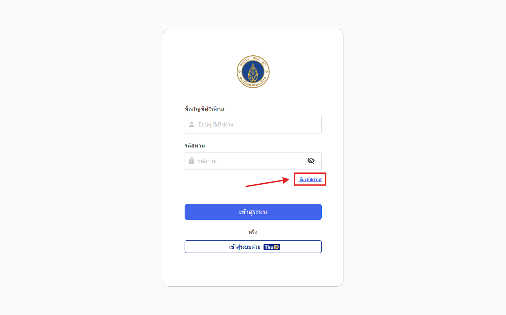
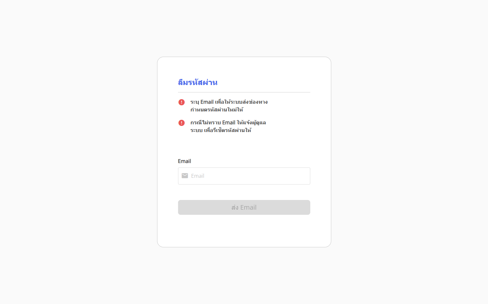

## ขั้นตอนการขอรหัสผ่านใหม่

1. บนหน้าล็อกอิน ให้คลิกปุ่ม **ลืมรหัสผ่าน**  
    
    
2. กรอกอีเมลที่ใช้ลงทะเบียนกับระบบ (ชื่อ.นามสกุล 3 ตัว @mahidol.ac.th) แล้วคลิก **ส่ง**  
   - ระบบจะส่งอีเมลพร้อมลิงก์สำหรับกำหนดรหัสผ่านใหม่ไปยังอีเมลดังกล่าว  
   
3. ตรวจสอบกล่องข้อความในอีเมลของคุณ (รวมถึงโฟลเดอร์สแปม)  
4. คลิกลิงก์ในอีเมล เพื่อไปยังหน้ากำหนดรหัสผ่านใหม่  
5. กรอกรหัสผ่านใหม่ และยืนยันรหัสผ่านอีกครั้ง  
6. คลิก **บันทึก** เพื่อยืนยันการเปลี่ยนแปลง  
7. กลับไปที่หน้าล็อกอิน แล้วเข้าสู่ระบบด้วยรหัสผ่านใหม่ได้ทันที  

:::note
หากไม่ทราบหรือไม่สามารถเข้าถึงอีเมลที่ลงทะเบียนไว้ กรุณาแจ้งผู้ดูแลระบบเพื่อขอให้ช่วยรีเซ็ตรหัสผ่านให้  
:::