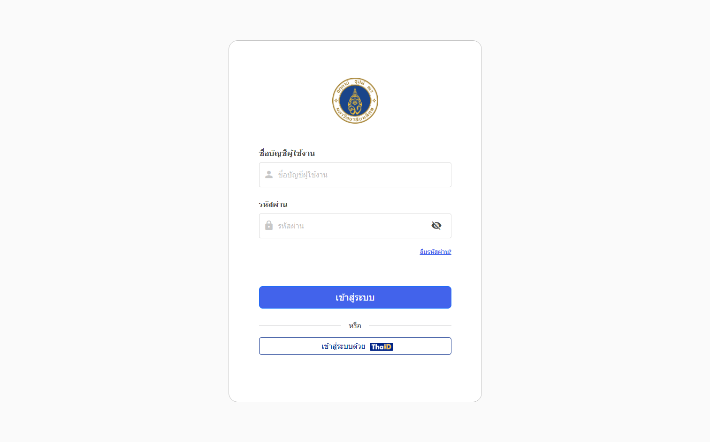

## การเข้าถึงระบบ

เข้าใช้งานได้ที่  
🔗 https://eoffice.mahidol.ac.th/

## วิธีการยืนยันตัวตน

ระบบรองรับการยืนยันตัวตน 2 วิธีหลัก:

1. บัญชีผู้ใช้งานและรหัสผ่าน  
   - กรอกชื่อผู้ใช้งาน (Username) ชื่อผู้ใช้งานสำหรับบุคลากรจะใช้รูปแบบ `ชื่อจริง.นามสกุล 3 ตัวแรก` และรหัสผ่าน (Password)  
   - คลิกปุ่ม **เข้าสู่ระบบ**  
   - หากข้อมูลถูกต้อง จะเข้าสู่หน้าหลักของระบบทันที  

2. เข้าสู่ระบบด้วยแอพพลิเคชัน **ThaiD** (แนะนำวิธีนี้)  
   - ต้องทำการลงทะเบียนกับแอพพลิเคชัน ThaiD ให้เรียบร้อยก่อน  
   - ดูขั้นตอนการลงทะเบียนได้จากคู่มือ:  
     🔗 [การลงทะเบียน ThaiD สำหรับระบบ e-Document](/blog/thaid-for-electronic-documents)  
   - เมื่อพร้อมแล้ว เปิดแอพ ThaiD และเลือกเมนู **ยืนยันตัวตนด้วย e-Office**  
   - สแกน QR Code ที่ปรากฏบนหน้าจอ  
   - ยืนยันการเชื่อมต่อในแอพ แล้วระบบจะพาคุณเข้าสู่ระบบ e-Document โดยอัตโนมัติ  

:::info[คำแนะนำ]
การใช้ ThaiD ช่วยเพิ่มความปลอดภัยและความสะดวกสบาย แนะนำให้ใช้งานวิธีนี้เป็นหลัก  
:::