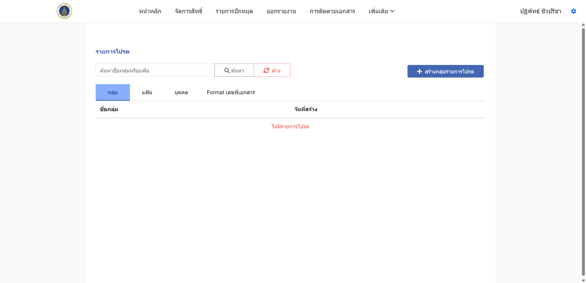
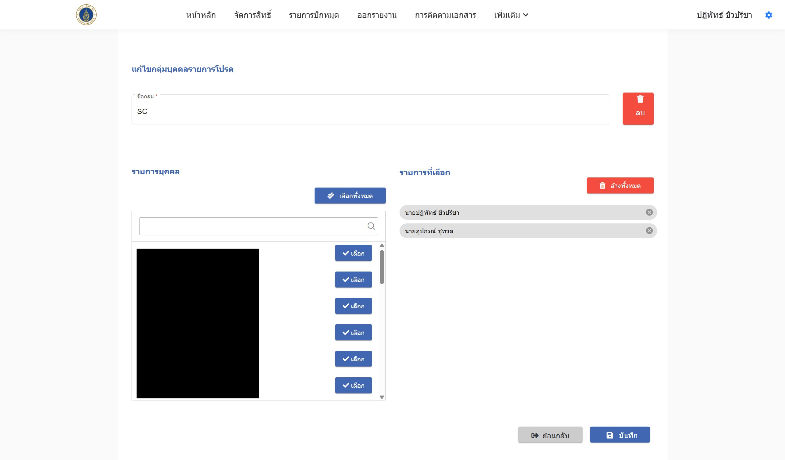
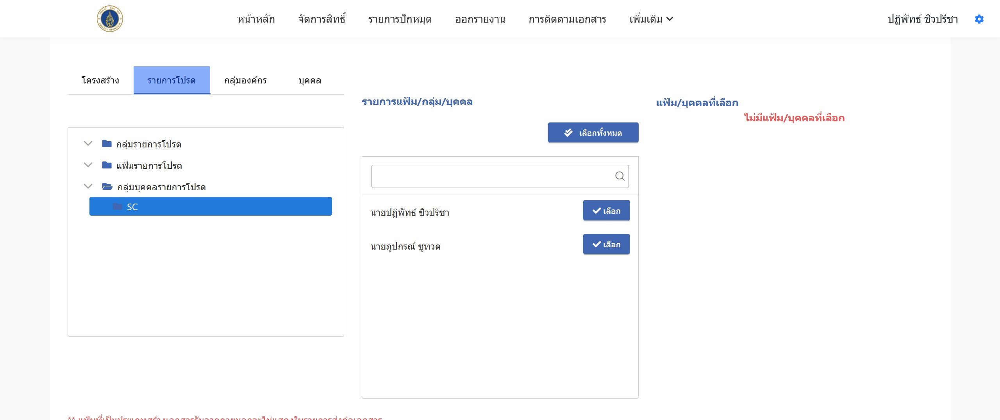

ในการตั้งค่ารายการโปรดจะช่วยลดเวลาการค้นหาบุคลากร เนื่องจากรายชื่อบุคลากรนั้นมีจำนวนมาก และอาจจะเกิดการเลือกผิดคน โดยขอแนะนำเป็นขั้นตอนการเพิ่มรายชื่อโปรด ดังนี้:

1. ไปที่เมนู **เพิ่มเติม > รายการโปรด**  
   ระบบจะนำทางไปยังหน้าแสดงรายการโปรดที่บันทึกข้อมูลอยู่ในผู้ใช้ปัจจุบัน โดยจะแบ่งรายการโปรดออกเป็น:
   - กลุ่ม
   - แฟ้ม
   - บุคคล
   - Format เลขที่เอกสาร

   

2. หากต้องการสร้างรายการบุคคลในรายการโปรด:
   - ไปที่หัวข้อ **บุคคล** และกดปุ่ม **สร้างกลุ่มบุคคลในรายการโปรด**

     

   - กำหนดชื่อกลุ่ม และเลือกรายการบุคคลที่ต้องการ
   - จากนั้นกดปุ่ม **บันทึก**
3. การนำไปใช้งานในฟังก์ชันการส่งต่อ:
    - เมื่อเลือกการส่งต่อเอกสาร ระบบจะแสดงหัวข้อ **รายการโปรด** เพื่อให้ผู้ใช้สามารถเลือกบุคคลหรือกลุ่มที่บันทึกไว้ในรายการโปรดได้อย่างรวดเร็ว
    - เลือกรายการโปรดที่ต้องการ และดำเนินการส่งต่อเอกสารตามขั้นตอนปกติ

    