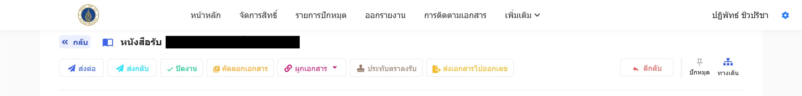
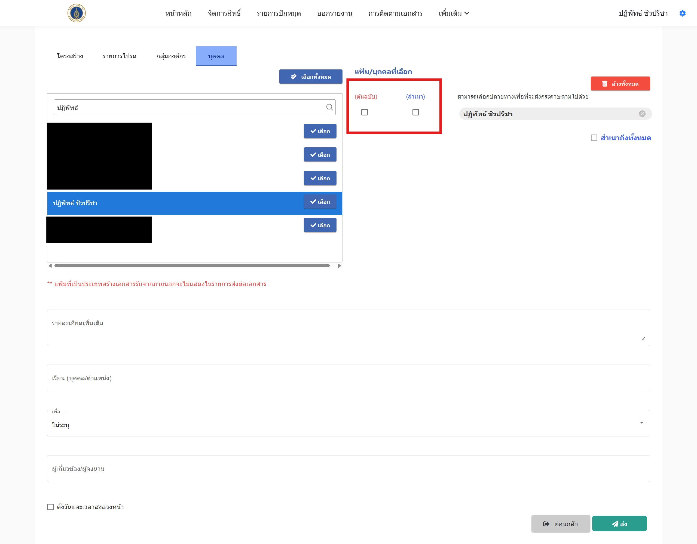

หลังจากรับเอกสารเป็นที่เรียบร้อย หากท่านต้องการส่งต่อเอกสาร ให้กดที่ปุ่ม **ส่งต่อ** ระบบจะนำทางไปสู่หน้าเลือกผู้ส่งต่อ ท่านสามารถเลือก **หน่วยงาน**, **รายการโปรด**, **กลุ่มองค์กร**, และ **บุคคล** 

ในตัวอย่างนี้ขอเลือกเป็น **บุคคล** โดยท่านสามารถค้นหาบุคลากรได้ทั้งหมดตามรูปด้านล่าง:

เมื่อท่านเลือกบุคลากรที่จะส่งต่อเอกสารเสร็จสิ้น ท่านสามารถเลือกได้ว่าเอกสารที่ท่านจะส่งต่อนั้นเป็น **เอกสารต้นฉบับ** หรือ **สำเนา** 

นอกจากนี้ ท่านสามารถกรอกข้อมูลรายละเอียดเพิ่มเติม เช่น **เรียนใคร** และ **เพื่ออะไร** 

สุดท้ายเมื่อเสร็จสิ้น ให้กดปุ่ม **ส่ง** เพื่อให้ระบบทำการส่งเอกสารนี้ให้กับบุคคลที่ท่านได้กำหนดไว้