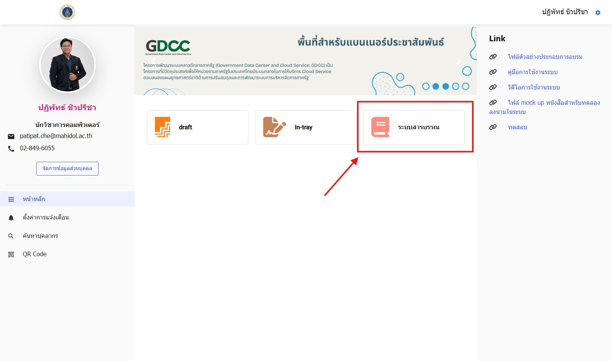
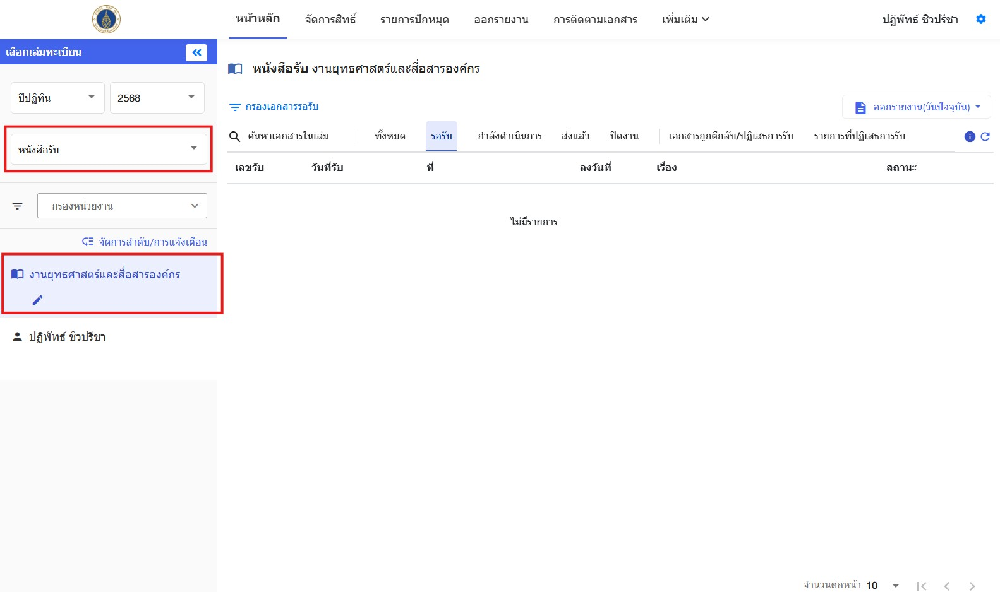
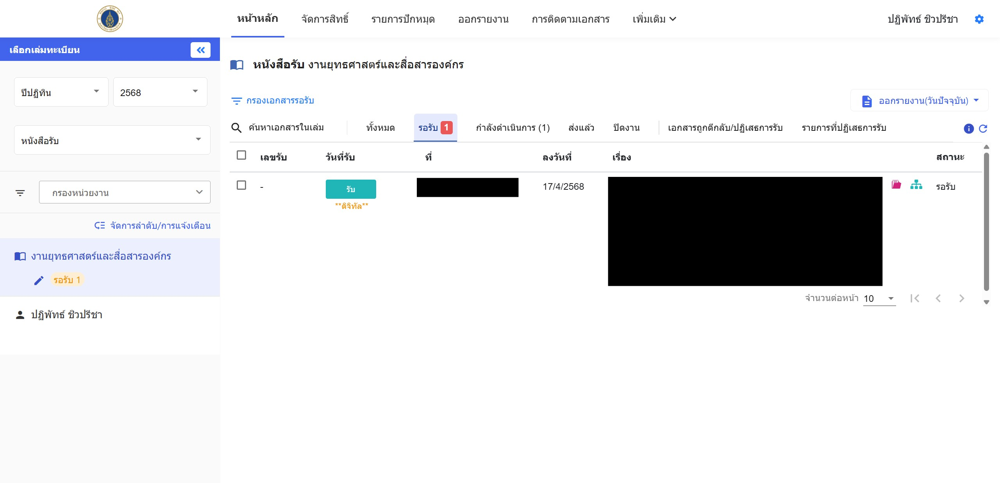
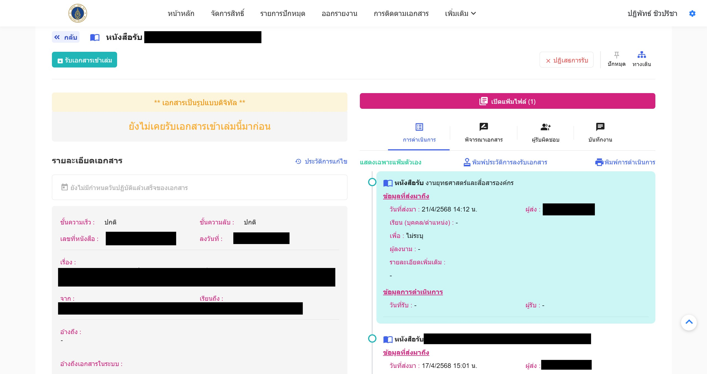
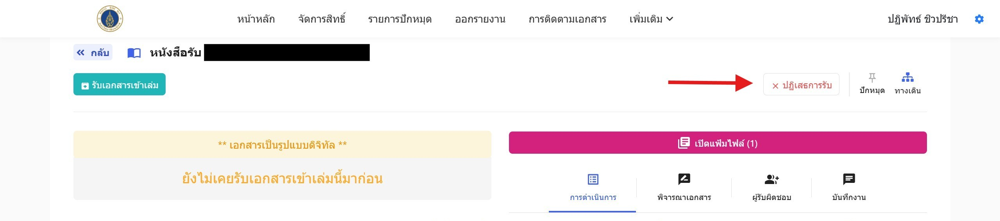
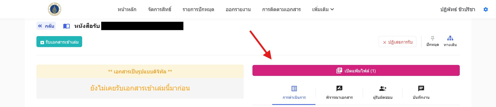
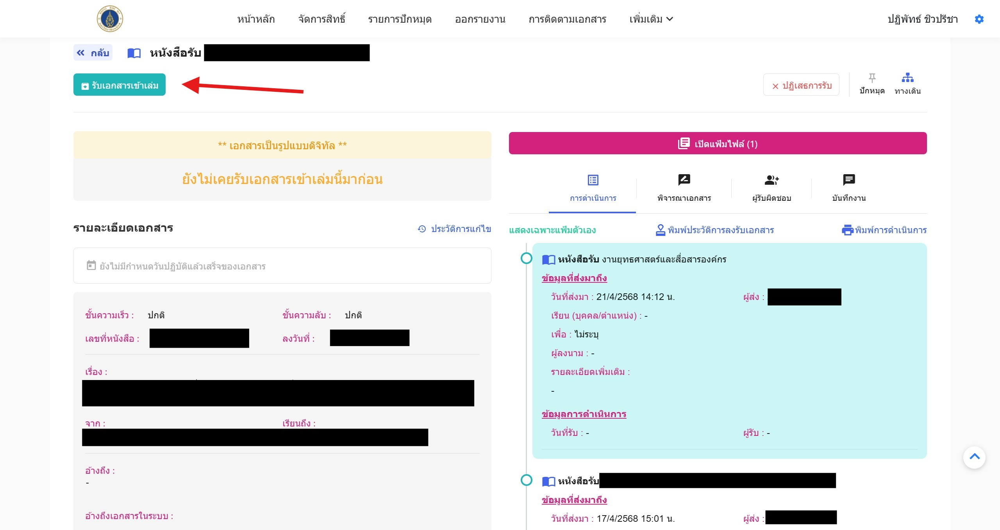

1. เข้าสู่ระบบ e-Office  
   

2. เลือกแฟ้มทะเบียนประเภท “หนังสือรับ” และเลือกเล่มทะเบียนตามชื่อฝ่ายงานของตนเอง หรือ ถ้าเป็นการส่งต่อเอกสารถึงท่าน เอกสารจะอยู่ในชื่อของท่าน
   
   :::info[ประเภทเอกสาร]
   - **ต้องรอต้นฉบับ** หมายถึง สารบรรณจะส่งเอกสารตัวจริงทั้งหมดให้ Admin งาน
   - **ต้องรอสำเนา** หมายถึง สารบรรณจะส่งสำเนากระดาษให้ Admin งาน
   - **ดิจิทัล** หมายถึง Admin งาน ดูไฟล์แนบเอกสารจากระบบ (ไม่ต้องรอต้นฉบับและสำเนา)
   :::
3. ไปที่แท็บ **รอรับ** เพื่อดูรายการเอกสารที่รอรับเข้าเล่มของแต่ละงาน
   

4. คลิกที่รายการเอกสารเพื่อดูรายละเอียดเอกสาร แล้วตรวจสอบความถูกต้อง
   
   :::warning[ข้อควรระวัง]
   1. ตรวจสอบข้อมูลความถูกต้อง หากเป็นเอกสารที่ส่งมาไม่ถูกต้องท่านสามารถปฏิเสธการรับได้
   
   2. ตรวจสอบไฟล์เอกสารได้โดยกดปุ่ม `เปิดแฟ้มไฟล์`
   
   :::
5. หากต้องการรับเอกสารเข้าเล่ม ให้กดปุ่ม **รับเอกสารเข้าเล่ม**  
   
   หลังจากรับเอกสารเข้าเล่มแล้ว ผู้ใช้งานจะสามารถดำเนินการต่างๆกับเอกสารที่รับไว้ได้
   