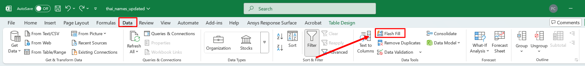
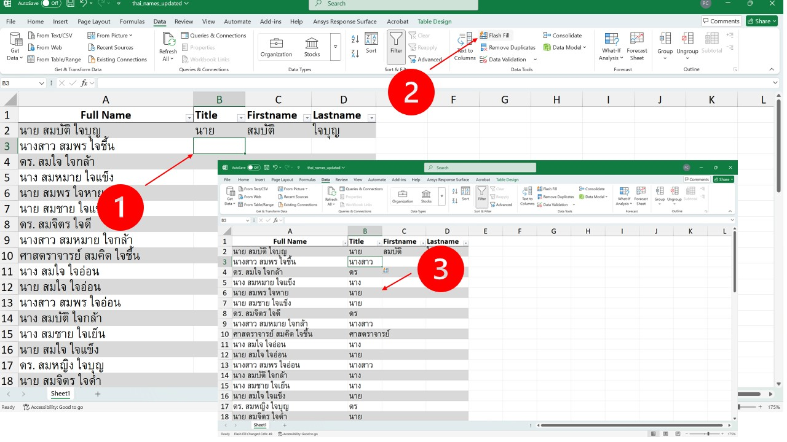

# Flash Fill ใน Excel

## บทนำ
Flash Fill เป็นฟีเจอร์ใน Excel ที่ช่วยให้คุณสามารถกรอกข้อมูลอัตโนมัติตามรูปแบบที่คุณต้องการได้อย่างรวดเร็วและง่ายดาย โดยไม่ต้องเขียนสูตรหรือใช้ฟังก์ชันใดๆ

## การเตรียมข้อมูล
ก่อนที่จะใช้ Flash Fill คุณต้องเตรียมข้อมูลให้พร้อม โดยข้อมูลที่ต้องการกรอกอัตโนมัติควรอยู่ในคอลัมน์ที่ติดกัน และมีตัวอย่างข้อมูลที่ต้องการกรอกอย่างน้อยหนึ่งแถว

## วิธีการใช้
1. ใส่ตัวอย่างข้อมูลที่ต้องการกรอกในเซลล์แรกของคอลัมน์ที่ต้องการ
2. เลือกเซลล์ถัดไปในคอลัมน์เดียวกัน
3. ไปที่แท็บ `Data` และคลิกที่ปุ่ม `Flash Fill` หรือกด `Ctrl + E`

4. Excel จะกรอกข้อมูลที่เหลือตามรูปแบบที่คุณใส่ในตัวอย่าง

## การนำไปใช้กับการแยกคำนำหน้า ชื่อจริง นามสกุล
ตัวอย่างเช่น หากคุณมีข้อมูลชื่อเต็มในคอลัมน์ A และต้องการแยกคำนำหน้า ชื่อจริง และนามสกุลออกมาในคอลัมน์ B, C และ D ตามลำดับ คุณสามารถทำได้ดังนี้:

1. ใส่คำนำหน้าของชื่อแรกในคอลัมน์ B
:::note

ข้อมูลคำนำหน้ามีรูปแบบที่แน่นอน ควรเติมตัวอย่างข้อมูลให้ครบ เช่น นาย นาง นางสาว ดร. และอื่นๆ

:::
2. ใส่ชื่อจริงของชื่อแรกในคอลัมน์ C
3. ใส่นามสกุลของชื่อแรกในคอลัมน์ D

4. เลือกเซลล์ถัดไปในคอลัมน์ B และกด `Ctrl + E` เพื่อใช้ Flash Fill หรือไปที่เมนูแท็บ `Data` และคลิกที่ปุ่ม `Flash Fill`

5. ทำเช่นเดียวกันกับคอลัมน์ C และ D

Flash Fill จะกรอกข้อมูลที่เหลือตามรูปแบบที่คุณใส่ในตัวอย่าง ทำให้คุณสามารถแยกคำนำหน้า ชื่อจริง และนามสกุลได้อย่างรวดเร็วและง่ายดาย